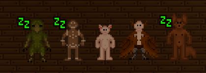
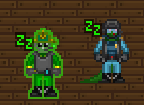
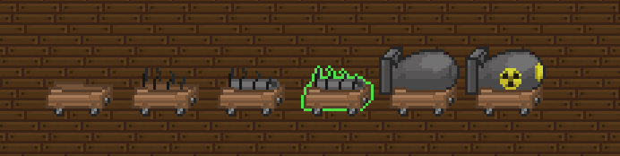
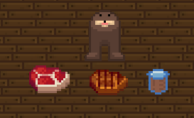
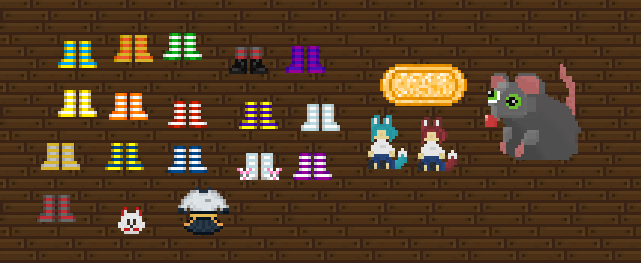
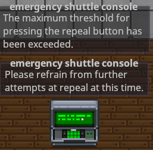
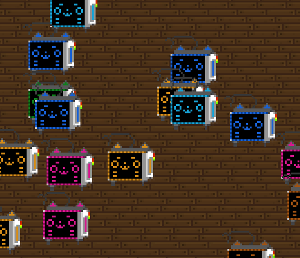
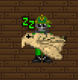
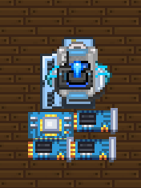

# Changelog 00: Changelog Reconsolidation
Now that we have a proper website for changelogs, I'm going back to all the old ones and consolidating them into a single one, basically a list of all goob specific features.

::github{repo="Goob-Station/Goob-Station"}
### We are always open to new contributions, got something silly you wish was added to SS14? Make a pull request to our fork!
---

## Wizard Antagonist
Wizards from SS13 are here, and come with a ton of cool spells. 
:::note
As of writing this they are disabled, will make this better when we re-enable them.
:::
## Custom Races

### Felinids, Vulps, Harpies, Gingerbread, and Vox.
Vox and Gingerbread are reenabled, and we've merged content from DeltaV to add the other races.

## Custom Roles

### Blueshield Officer and Nanotrasen Representative
Two roles with a higher standard of roleplay. NTR supervises the heads and gives them commands from CC, meanwhile blueshield acts as a bodyguard for them.

## Makeshift Nuke

Syndicate can now make their own nuke without need for a nuke disc or codes. They require quite a few materials, namely uranium, and science will have to have certain researches unlocked.

## Gondolas and Tranquility

We've added gondolas, which can be aquired by buying a crate as syndie. They are peaceful creatures that can't speak, have no hands, and cant attack. Butchering them gives you gondola steak, which tranquility can be extracted from. Tranquility causes the person to become mute and a pacifist in small doses, and turns them into a gondola in larger doses, with no way of turning back.

## A ton of custom items.

We've added a lot of custom items made by the community, including plushies, way too many socks, some clothes, and banana soap, which acts as an intermediary soap between normal and syndie soap.

## Explosive Evac Console

Due to certain command members not being able to help themselves from spamming the evac console, it now violently explodes after being spammed.

## Kerfur Medibot

The medibot has a new sprite, based on everyone's favorite grocery shopping companion. They also spawn little hearts and meow now when you pet them!

## Carrying System

The carrying system from DeltaV/Frontier has been ported over, so now you can carry your injured crewmates to medbay instead of dragging them along the floor like a terrible person.

## Cloning Boards in CMO's Locker

Since cloning was removed from research, now CMO spawns with circuit boards in their locker roundstart.

## Other Minor Changes
#### Syndicats only cost 7 tc, and throngler can be purchased for 100 tc.
#### Custom music and custom backgrounds
#### Nukie round has TF2 announcer effects
#### Minor buff to skub and bike horn, clown mains rejoice.
#### Pink and blue shoes for the wardrobes, because someone on discord REALLY wanted them.
#### A lot of custom smites for admemes to mess around with
#### Ban reasons now show banning admins username, helps with ban appeals.
#### Train isn't avaliable unless player count is at 100. Good luck playing it.

