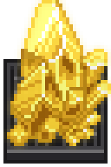
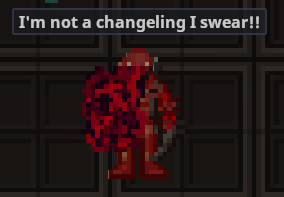
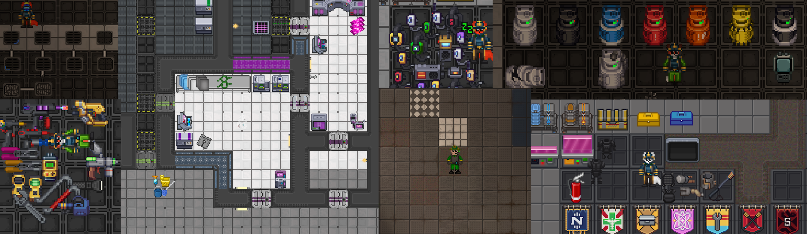
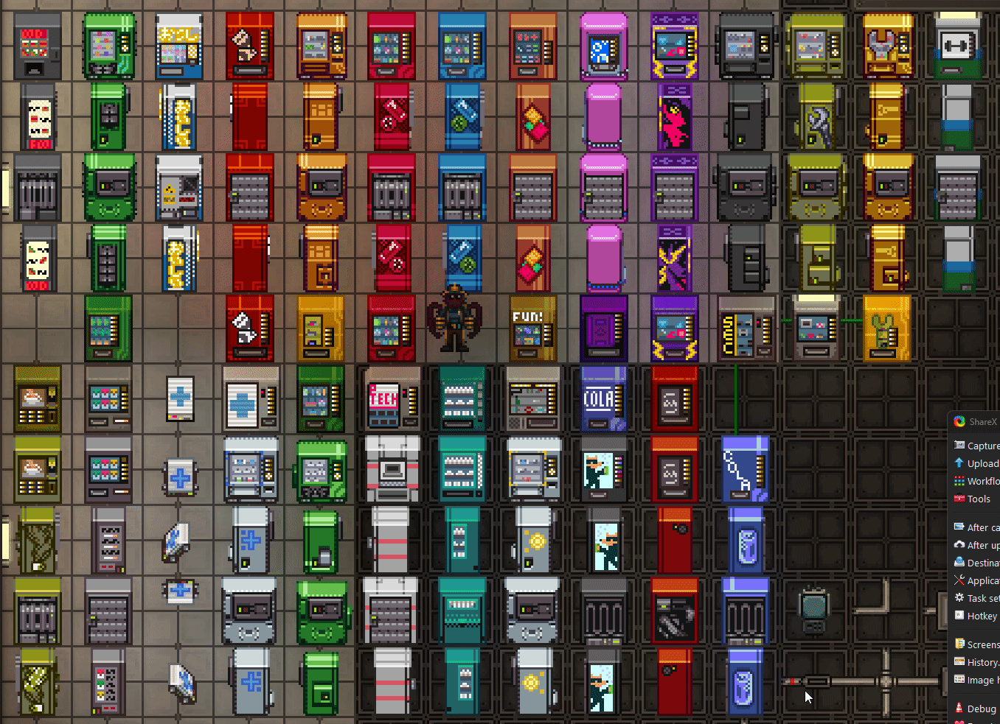
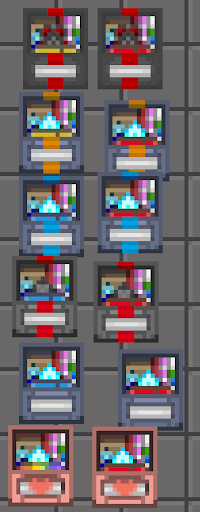
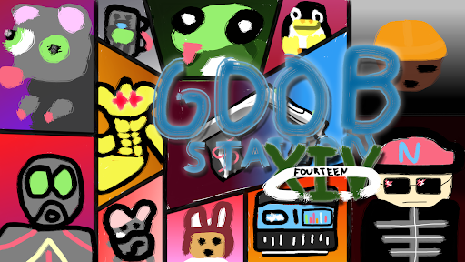

# Changelog 01: This is only the beginning!
## Since the last changelog was posted here, so much has happened...

### - Space Station 14 was featured at the PC Gamer Show, gaining traction to both Goob and SS14 as a whole, we've hit over 1,000 people in our Discord, and 12,000 unique players on the server.
The PC Tide (influx of players from PC Gamer Show) hit us, and it hit us hard. During the first day we maxed out our playercount at 100, leading it to be upped to 250. Due to some hosting issues it was capped at 140 for another day. By the third day it was fixed but the tide was dying down, and we reached a max player count of 187. Among the hordes of new players we also had to deal with insistent raiders and DDoS attempts, but thanks to our lovely staff team putting all hands on deck, we managed to survive. The entire week of PC Tide was a learning experience for us as well, leading us to redefine a lot of our internal infrastructure. Through all the mess of it though, we've got a great example of what we want the Goobstation experience to be, a mix of chaos and roleplay that leads to a experience more like SS13. (I've included some videos below that I think are great examples of this.)
<iframe width="560" height="315" src="https://www.youtube.com/embed/lNwtheHGCHg?si=rgXt_YAQKk0P-Tf0" title="YouTube video player" frameborder="0" allow="accelerometer; autoplay; clipboard-write; encrypted-media; gyroscope; picture-in-picture; web-share" referrerpolicy="strict-origin-when-cross-origin" allowfullscreen></iframe>
<iframe width="560" height="315" src="https://www.youtube.com/embed/wIkmv5qA-Uw?si=8H65CQdemvJ1nyo0" title="YouTube video player" frameborder="0" allow="accelerometer; autoplay; clipboard-write; encrypted-media; gyroscope; picture-in-picture; web-share" referrerpolicy="strict-origin-when-cross-origin" allowfullscreen></iframe>
<iframe width="560" height="315" src="https://www.youtube.com/embed/sqQ8rkj1rQs?si=TR2lmusDkiaEzGpI" title="YouTube video player" frameborder="0" allow="accelerometer; autoplay; clipboard-write; encrypted-media; gyroscope; picture-in-picture; web-share" referrerpolicy="strict-origin-when-cross-origin" allowfullscreen></iframe>

### - The repo was completely refactored to fit new conventions
This was a personal goal of mine, the repo was previously a mess of content put direclty into the repo. Finding and porting all this content was hell and took forever, but we now use folder schemas similar to Nyano/Delta which has made merging upstream much less of a headache.

### - A lot of content was added!
As you'll see below, plenty more content has been added and is being actively worked on. In particular I want to mention a few contributors for the hard work they've put in.\
[VMSoldius](https://github.com/VMSolidus) and the entire team over at [Einstein Engines](https://github.com/Simple-Station/Einstein-Engines), for their tireless work on their fork and willingness to listen and improve from our feedback.\
[whateverusername0](https://github.com/whateverusername0), also known as John Station, for his work on Supermatter and Changelings, we strive to make our gameplay more diverse, and adding more antagonists plays a large part in that.\
[Piras314](https://github.com/Simple-Station/Einstein-Engines), for wrangling the contributors and making my life just a little easier.

### Finally, I want to thank all the players, contributors, and staff that have made the success of this server possible, and I know we have a lot more to look forward to in the following months! - Durk
---
## Supermatter Engine - VMSoldius & whateverusername0

Supermatter is a powerful generator from SS13, originally taken from Whitedream, it's been reworked further by both VMSoldius and whateverusername0. It produces radiation and electrical arcs, and requires active cooling less it delaminates. We recommend reading the guidebook entry to learn more.

## Changelings - whateverusername0

Changelings have been added to the game and while they’re still in an initial playtesting stage, they’re a ton of fun to play around with. Changelings have all kinds of abilities ([see here](https://github.com/space-wizards/space-station-14/pull/30094)) but the main idea of Changelings is that they are meant to kill and absorb the station’s inhabitants using the plethora of abilities they can unlock.

## Space Wind + Frictionless Space - VMSoldius
<video width="600" controls>
  <source src="https://cdn.discordapp.com/attachments/675078881425752124/1261702016032571432/ListeningPostScuttling.mp4?ex=669e7711&is=669d2591&hm=98f1caf6e1b37aae9f28003aed4b8420cc972a4db049e90d5b6486deb10d9df3&" type="video/mp4">
</video>

VMSoldius used his massive physics nerd brain to refactor space wind completely, it now behaves properly according to the atmospherics instead of randomly tossing shit around. Along with this we’ve also ported frictionless space to make it extra deadly.
## Resprite from Einstein Engines - FoxxoTrystan & VMSoldius
 

All sprites from EE have been ported over to Goobstation, this helps us along quite a bit with our plan to change all sprites to their Paradise Station counterparts.
## Survival Box Rework - Durk & gtheglorius

The survival box has been effectively useless since the new inventory system was released. When a player takes a single item out of it, it becomes garbage that takes up too much space. This reworks the survival box to a slot-based system, and takes up a 2x2 space instead of 3x3, meaning it stays useful for much longer.

## All-new Lobby Art! (and music) - Piras314, Durk, ka2220, Icepick, & PubliclyExecutedPig

All of the lobby art and music (except space asshole) have been replaced! Many of the lobby screens were made specifically for Goob!

## Durathread Armour - a-person5660 & Piras314
<video width="600" controls>
  <source src="https://private-user-images.githubusercontent.com/40855173/340993536-87b83194-2c3d-416f-bf9b-74706938ce04.mp4?jwt=eyJhbGciOiJIUzI1NiIsInR5cCI6IkpXVCJ9.eyJpc3MiOiJnaXRodWIuY29tIiwiYXVkIjoicmF3LmdpdGh1YnVzZXJjb250ZW50LmNvbSIsImtleSI6ImtleTUiLCJleHAiOjE3MjE2MTU1MjQsIm5iZiI6MTcyMTYxNTIyNCwicGF0aCI6Ii80MDg1NTE3My8zNDA5OTM1MzYtODdiODMxOTQtMmMzZC00MTZmLWJmOWItNzQ3MDY5MzhjZTA0Lm1wND9YLUFtei1BbGdvcml0aG09QVdTNC1ITUFDLVNIQTI1NiZYLUFtei1DcmVkZW50aWFsPUFLSUFWQ09EWUxTQTUzUFFLNFpBJTJGMjAyNDA3MjIlMkZ1cy1lYXN0LTElMkZzMyUyRmF3czRfcmVxdWVzdCZYLUFtei1EYXRlPTIwMjQwNzIyVDAyMjcwNFomWC1BbXotRXhwaXJlcz0zMDAmWC1BbXotU2lnbmF0dXJlPWFlOTRmNjA4OTI2MjJkZTI1ODMyMjc3NDJiNGJjZDQxNzBkM2Q1ZjU2ODc0MmIwNjFiMDE0NTUxZWViMDQ1OTUmWC1BbXotU2lnbmVkSGVhZGVycz1ob3N0JmFjdG9yX2lkPTAma2V5X2lkPTAmcmVwb19pZD0wIn0.AePrhcrSq29Npn3Vi7DTow6C0bIG17b26tzADARrSl0" type="video/mp4">
</video>
Dura-thread Armour has been added to the game, it’s able to be produced via emagged uniform printer and is similar to a syndicate web-vest statistics-wise, albeit slightly worse. There are 3 dura-thread armours: Dura-thread Armour, Dura-thread Jump-suit, and Dura-thread Web Vest.

## Uplink Price Rework - Piras314, Durk, & TooSillyFennec
All telecrystal values have been multiplied by 5 and almost all values have been rebalanced to encourage and discourage the use of different items, mainly based on what’s bought too often and what you rarely see, trying to diversify syndicate strategy. This allows us to have a lot more flexibility when balancing or adding syndicate / uplink items in the future as well.

## SMES Buff - Piras314
SMES have been buffed to be twice as good as before in every way. This makes it so that Engineers have a reasonable amount of time to set up power without it ever going out, as before it was extraordinarily rare that Engineers would be able to set up power fast enough that the power wouldn’t be out for 5-10 minutes, which would simply be unfun for the entire station crew, even the Engineers.

## Rebalanced Pipestacking - Ilya246 & BasedUser
Pipestacking has been reintroduced in a limited fashion. Devices can be anchored over pipes again, and pipes can exist within the same tile as long as they have different flow directions.

## Revert Pressure Damage - Piras314
Space is supposed to be scary and deadly. We reverted the pressure damage changes that allowed players to spacewalk without a suit, and outheal it by sleeping in a bed.

## Automated Goob Changelog - Piras314
Goob finally has a changelog in-game thanks to Piras.

## Other Changes
#### A recharging pie cannon for Syndicate Clowns was added - Piras314
#### Syndicate Fire Axes and De-Swords were re-added - Ilya246
#### Pressure damage changes from upstream were reverted - Piras314
#### Space Ninjas now have microbombs instead of death acidifiers - a-person5660
#### Playtime transfers were made easier - Flyingkarii
#### Mass sabotage before 30 minute rules were added - Piras314
#### The MedHud icons were changed - Teapug
#### Ores are now generated on planetmos planets - PoTeletubby
#### Traitors are now more likely to have objectives to kill each other - misandrie
#### Emitters and containment field generators were made cheaper - Piras314
#### Fire door remotes were re-added - a-person5660
#### More Traitor flavour text was added - whateverusername0
#### Lil Cal puppet from Homestuck - Durk & gtheglorius
#### Anomaly locator now spawns in the RD’s locker - a-person5660
#### EMT Belt respite - JoeHammad1844
#### Medhud crit/dead icons have been updated - Teapug
#### Centcom backpack and NTR satchel - Teapug
#### Dwarves are a little bit wider now - Durk
#### Headrevs spawn with syndie encryption keys - TooSillyFennec
#### Containment fields and emitters have been significantly reduced in price - Piras314
#### Fire door remotes were readded - a-person5660
#### New Hairstyles - Bloomyex & BeeRobynn
#### Chief Engineer now has a handheld power console - Doggo5852
#### Cryo and Bluespace syringe slightly buffed - a-person5660
#### Foam throngler was added to the grand lottery - Scruq445
#### Added dual antag gamemodes - TooSillyFennec

---
::github{repo="Goob-Station/Goob-Station"}
### We are always open to new contributions. Do you have something silly you want added to Goob? Make a pull request!