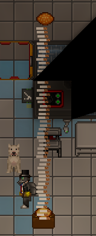
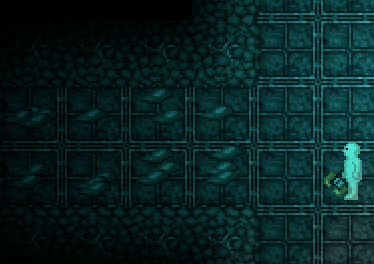
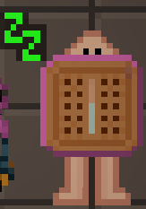
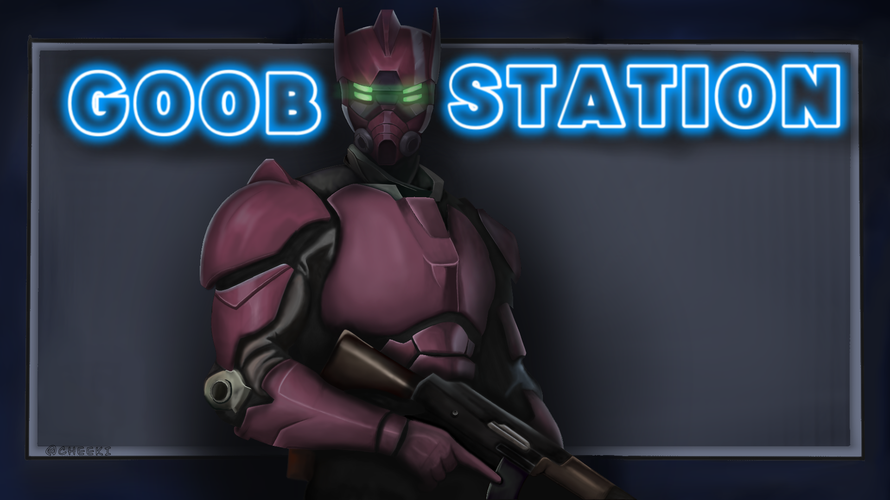
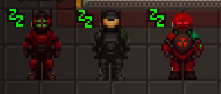

### AKA, I'm outta here losers
When I first joined Goobstation, it was known as the “funny unserious LRP server” where players were encouraged to have fun within the bounds of the rules. I was excited to be a part of that and aimed to make the game enjoyable for everyone. However, the server has since shifted in a different direction. While this change isn’t inherently bad, it’s not the path I initially signed up for, and it’s not one I want to continue down.

This decision has been a long time coming, as I’ve noticed the culture changing over the past few months. It is what it is. I wish most of you the best of luck moving forward.
#### One love, Durk.
<iframe width="775" height="315" src="https://www.youtube.com/embed/Ktatsqnb4Cw?si=Ni99cb4n4g4k1KoA" title="YouTube video player" frameborder="0" allow="accelerometer; autoplay; clipboard-write; encrypted-media; gyroscope; picture-in-picture; web-share" referrerpolicy="strict-origin-when-cross-origin" allowfullscreen></iframe>

---
## Ghostbar - Durk
I finally got off my ass and added ghostbar, after dying you can choose to respawn here as a random job and do whatever you want inside, (still within the rules of course.)

## Chrono Legionnaire - BombasterDS
Chrono Legionnaire are an admin only 'antag.' They are similar to terminators, and are designed to remove players with real life people/characters as their IC names. They have a bunch of fun tools and gadgets like the timeline disruptor, stasis gun, stasizium injectors, sonic screwdriver, and a bunch of cool armor. 

## Paradise Nanotrasen Representative - Durk

The Nanotrasen Representative finally matches its paradise counterpart and is no longer puke green, they also spawn with an exclusive NT branded cane blade.

## Everything Burgers - Durk

Almost everything can now be put onto burgers, hooray!

## Glue and Lube grenades - jorgun
Glue and lube grenades have been added to the mime and clown's uplinks respectively. Go forth and doom sec to a slippery death.

## "Throngler" added to grand lottery. - Scruq445
A foam throngler was added to the grand lottery, it has the same stats as the normal throngler, but doesnt do any damage.

## Advanced Combat Medipens - a-person5660
Combat medipens have been made cheaper, and advanced combat medipens are now in the uplink as a better alternative to them.

## Action Bars Readded - yglop
Ever since changelings were added, its become frustrating to use the action bar when half the time the actions go off your screen, so action bar pages have been readded.

## Plasma Cutter - yglop

A researchable plasma based mining tool, makes cargo's life a lot more fun.

## Medical Patches - jorgun

Medical patches were added, effectively better pills. They apply a chem over time so doctors dont have to sit there slowly giving patients chems one syringe at a time.

## Energy Crossbow - yglop
Fun toy for syndies, shoots energy bolts that deal a decent amount of damage.

## New Lobby Art - cheki-ss14

Crazy good new lobby art by cheki.

## Syndie Suit Resprites - whateverusername0

## Syndiroach - Durk
A sidegrade to syndicats, they can crawl under doors and be put on your head.

## Other Changes
#### Tranquility from gondolas now affects all species and mobs.
#### Syndi microwaves have a smaller chance of exploding, normal microwaves have a small chance now aswell.
#### So many fucking ling changes and fixes, holy shit.
#### Friction'full' Space, the station and ATS have a minor amount of friction again.
#### Automatic updates, no more waiting for Durk to get on and update the server.
#### New lobby song "Space Radiation".
#### Emote wheel properly shows emotes for your species.
#### Cleanbot looks a lot nicer and has direction sprites.
#### Skubstub song added, a remix of skubstep.
---
::github{repo="Goob-Station/Goob-Station"}
### We are always open to new contributions. Do you have something silly you want added to Goob? Make a pull request!