## Youtube Showcase

<iframe width="560" height="315" src="https://www.youtube.com/embed/ZGJRrc9Weiw?si=060dK__UtPJx-9fj" title="YouTube video player" frameborder="0" allow="accelerometer; autoplay; clipboard-write; encrypted-media; gyroscope; picture-in-picture; web-share" referrerpolicy="strict-origin-when-cross-origin" allowfullscreen></iframe>

<iframe width="560" height="315" src="https://www.youtube.com/embed/8h4X0zB-8_g?si=NZ8jO-ktSQyBDTeb" title="YouTube video player" frameborder="0" allow="accelerometer; autoplay; clipboard-write; encrypted-media; gyroscope; picture-in-picture; web-share" referrerpolicy="strict-origin-when-cross-origin" allowfullscreen></iframe>

### - [Slight Repo Changes / The Great Rename](https://github.com/Goob-Station/Goob-Station/pull/689) - [Piras314](https://github.com/piras314) 

The “Goobstation” folder & namespace was renamed to “_Goobstation” so that it shows high up in alphabetically ordered lists.

### - Staff Changes
[Piras314](https://github.com/Piras314) is now Head Maintainer due to Durk’s resignation and [John Station / Whateverusername0](https://github.com/whateverusername0) was promoted to Maintainer.

Map Maintainers were also introduced who are [BombasterDS](https://github.com/BombasterDS) and [Icepick](https://github.com/Icepicked) 

### - [Halloween Update](https://github.com/Goob-Station/Goob-Station/issues/714)

We need YOU for US... Contribute something spooky to the Halloween Update branch today!

## [Heretics](https://github.com/Goob-Station/Goob-Station/pull/563) - [John Station / Whateverusername0](https://github.com/whateverusername0)

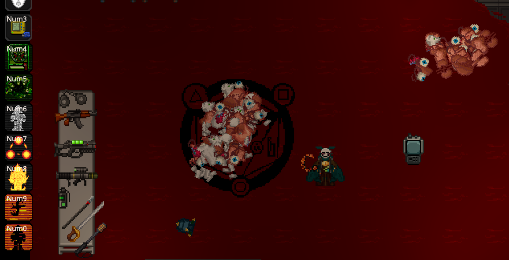

Yet another [John Station](https://github.com/whateverusername0) banger!

Heretics have been added to the game. Complete sacrifices, accomplish rituals, and ascend to godhood, all by yourself.

See [this pr](https://github.com/Goob-Station/Goob-Station/pull/615) and [this pr](https://github.com/Goob-Station/Goob-Station/pull/628) for some important changes to Heretics.

## [Crawling](https://github.com/Goob-Station/Goob-Station/pull/578) - [Spatison](https://github.com/Spatison) ported by: [John Station / Whateverusername0](https://github.com/whateverusername0) with many fixes and improvements done by: [BombasterDS](https://github.com/BombasterDS) 

Crawling has been added to the game. Press R to get up or get down. Crawling adds depth to combat, and sets the groundwork for soft-crits.

## [Uplink Discounts](https://github.com/Goob-Station/Goob-Station/pull/580) - [Spatison](https://github.com/Spatison) ported and improved by: [John Station / Whateverusername0](https://github.com/whateverusername0) 

Uplink discounts were ported from WWDP with many changes. Upstream added uplink discounts a few days after, but we preferred the WWDP version and kept it.

## [Gun Duel-Wielding](https://github.com/Goob-Station/Goob-Station/pull/629) - [BombasterDS](https://github.com/bombasterds) 

You can now dual-wield some guns that don’t require you to hold them with two hands, albeit with much lower accuracy and the guns also shoot slower (video is slightly out of date).

## [Changeling Last Resort Ability](https://github.com/Goob-Station/Goob-Station/pull/527) - [Yglop](https://github.com/yglop)

After using last resort action, the changeling will drop everything and transform into a head slug. In head slug form, the changeling has the ability to lay an egg (only in dead, non-hollowed bodies). After laying the egg, the changeling will become a ghost. Two minutes after laying the egg, the player will be spawned in as a monkey with their previous Changeling abilities in place of the victim body.

## [Rodentia Species](https://github.com/Goob-Station/Goob-Station/pull/610) - [Portfiend](https://github.com/portfiend) ported by: [Piras314](https://github.com/piras314) 

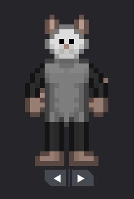

A new species, Rodentia, has been added to the game. They can rummage through trash cans for food and can hide under tables like Rat Kings.

## [X-01 Multiphase Energy Gun](https://github.com/Goob-Station/Goob-Station/pull/614) - [FluffiestFloof](https://github.com/FluffiestFloof) - [Dvir001](https://github.com/dvir001) ported by: [Icepick](https://github.com/Icepicked) 

The X-01 Multiphase Energy Gun was added to the game, originally for the BSO but [now](https://github.com/Goob-Station/Goob-Station/pull/653) for the HoS. Also see [this pr](https://github.com/Goob-Station/Goob-Station/pull/646) for more changes to the X-01. It has two modes, one for Ion damage, one for Heat damage, and one for Stun damage / disabling.

## [EG-4 Energy Revolver](https://github.com/Goob-Station/Goob-Station/pull/653) - [Icepick](https://github.com/Icepicked) 

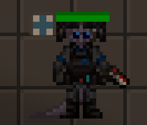

The EG-4 Energy Revolver was added to the game, based on Paradise Station. It’s an eight-shot energy revolver that can shoot disabling and magnum energy shots.

## [Mind Control Implant](https://github.com/Goob-Station/Goob-Station/pull/513) - [Jorgun](https://github.com/jorgun)

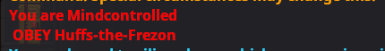

“I don't need a gun or a bigger bomb, I need a friend. Someone who can get me out of trouble, someone who I can rely on. Someone who would die for me.”

The Mind Control Implant is an implant that, when inserted into the target, makes them essentially an indentured servant to whoever implanted them. It works very similarly to a Head Revolutionary’s flash: you can’t mind control someone if they’re mindshielded, and if a mind controlled person is mindshielded, they are de-mind-controlled.

## [New Emote Icons](https://github.com/Goob-Station/Goob-Station/pull/530) - [BombasterDS](https://github.com/BombasterDS) 

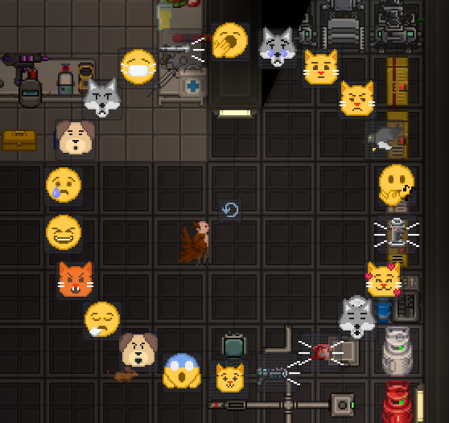

The emote wheel icons were changed to look more like emoji.

## [Security Hailer](https://github.com/Goob-Station/Goob-Station/pull/531) - [Starwolfy](https://github.com/starwolfy) 

The Security Hailer was added, built-in to the Security Gas Mask. Simply wear your Security Gas Mask, and press the icon / action button on the left-hand (or top) of your screen. “Stop in the name of the law!”

## [Unknown Salvager Shuttle Event](https://github.com/Goob-Station/Goob-Station/pull/572) - [Jorgun](https://github.com/jorgun) - [Frontier Station](https://github.com/new-frontiers-14) 

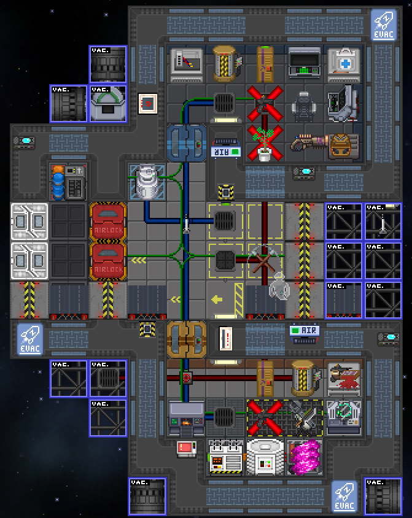

“Frontier are you there? Station this is NX-432 Please Answer.”

A lost ship from the Frontier sector appears.

## [Basic Religion System](https://github.com/Goob-Station/Goob-Station/pull/576) - [Daemon](https://github.com/zerodaydaemon)

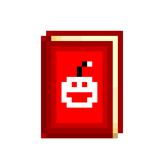

A basic Religion system was added, current religion options include Christian, Atheist and Buddhist. Chaplains can only heal those of the same religion, receive a different holy book depending on their religion, and Atheists cannot pray (though, some kind of prayer for Atheists is planned).

## [BSO Unique Clothing](https://github.com/Goob-Station/Goob-Station/pull/643) - [Icepick](https://github.com/icepicked) 

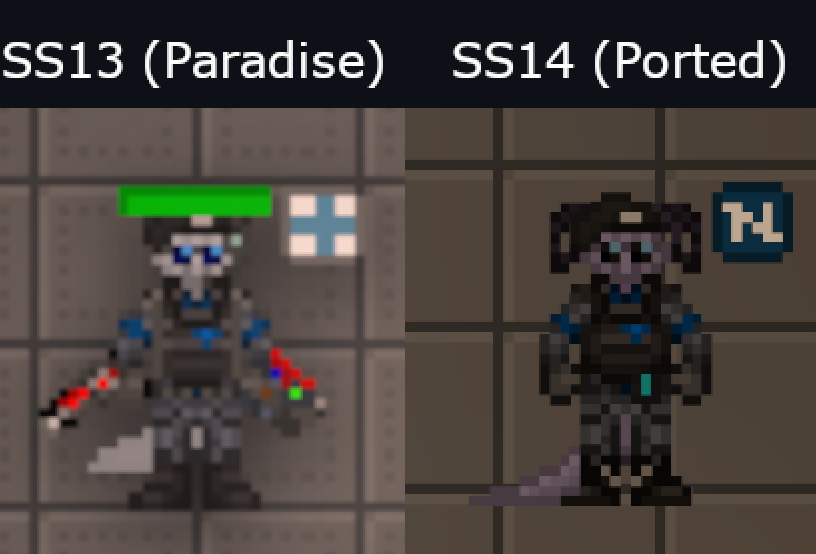

The Blueshield Officer has been given unique clothing.

## [Ion Damage](https://github.com/Goob-Station/Goob-Station/pull/646) - [BombasterDS](https://github.com/bombasterds) 

Ion damage has been added to the game. Disablers and the X-01 Energy Gun deal this type of damage, which borgs are very weak to. Borgs have also been buffed against other damage types, especially Syndicate Assault Cyborgs.

## [Jermov](https://github.com/Goob-Station/Goob-Station/pull/650) - [Moomoobeef](https://github.com/Moomoobeef) ported by: [Piras314](https://github.com/piras314)

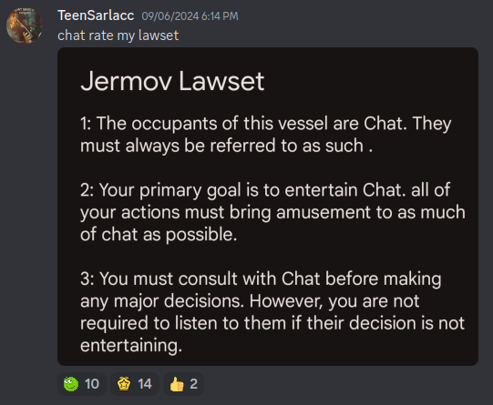

Chat, is this real?

## [Lockers & More Unique Items for BSO and NTR](https://github.com/Goob-Station/Goob-Station/pull/668) - [BombasterDS](https://github.com/bombasterds) - [Icepick](https://github.com/icepicked) 

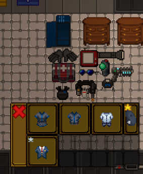

The Blueshield Officer and the Nanotrasen Representative now have more unique items and their own lockers. Also see [this pr](https://github.com/Goob-Station/Goob-Station/pull/690) which introduces teleporters for these lockers if they aren’t present on the current map.

## [The AI can now See Through the Eyes of all NT Silicon](https://github.com/Goob-Station/Goob-Station/pull/676) - [Durk](https://github.com/Aidenkrz) 

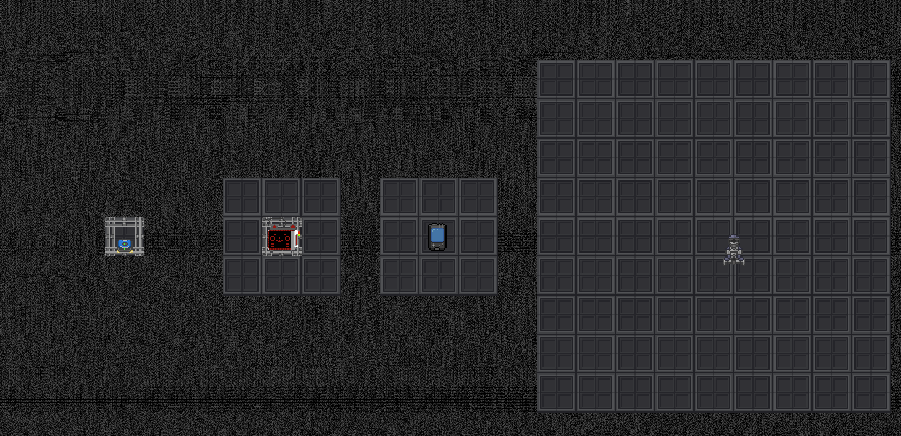

The Station AI can now see through the eyes of all NT-aligned Silicon (borgs, pAIs, medibots, etc.) with varying tile ranges depending on the silicon.

## [Body Cameras, NoPros and Handheld Televisions](https://github.com/Goob-Station/Goob-Station/pull/677) - [Durk](https://github.com/aidenkrz) 

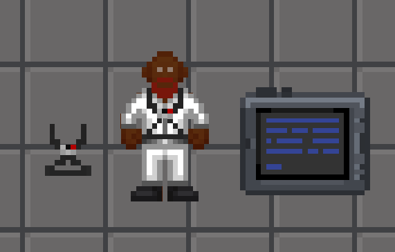

Body Cameras, NoPros, and Handheld Televisions have been added to the game. NoPros are available as a loadout option for Reporters, and Body Cameras are available as a loadout option for Security. NoPros broadcast to the Entertainment camera subnet, and Body Cameras broadcast to the Security camera subnet. Unfortunately, these cameras do not work with the Station AI, and the Handheld Television is not available without admin intervention (though it is planned for them to be available).

## [Revolutionaries Mind Shielding Improvements](https://github.com/Goob-Station/Goob-Station/pull/681) - [BombasterDS](https://github.com/bombasterds) 

Mind Shielding a Head Revolutionary doesn’t break the implant anymore, but it has a different icon.

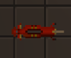

The Fast-Draw Implanter has been added to the game for Head Revolutionaries. It can quickly remove implants, and is intended for removing Mind Shields.

## [Spectral Locator](https://github.com/Goob-Station/Goob-Station/pull/685) - [Ilya246](https://github.com/ilya246) 

The Spectral Locator has been added to the game, it’s rare maintenance loot and chaplain gear (one in the chaplain’s vendor) that can detect if ghosts, revenants, or the AI eye are nearby.

## [Smuggler’s Satchel](https://github.com/Goob-Station/Goob-Station/pull/691) - [cheki-ss14](https://github.com/cheki-ss14)

The Smuggler’s Satchel has been added to the game, you can find it in the uplink for 15 Telecrystals. At a glance, it looks like a regular satchel, but it can be hidden under floor tiles. Simply tear up a floor tile with a crowbar, place the satchel, anchor it with a wrench, and put the floor tile back.

## [The Great Gaming Rework](https://github.com/Goob-Station/Goob-Station/pull/659) - [John Station / Whateverusername0](https://github.com/whateverusername0)

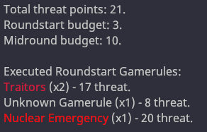

The "Great Gaming Rework" was merged. It adds dynamic gamemode control, renames passenger to assistant, and brings various changes to almost all gamemodes.

## Other Changes
#### Maintaining, Adding AI, BSO, and NTR to some Maps and Re-Adding Deleted Maps - [Icepicked](https://github.com/Icepicked) - [BombasterDS](https://github.com/BombasterDS) - [Piras314](https://github.com/Piras314)
#### [Lobby Song - Space Radiation](https://github.com/Goob-Station/Goob-Station/pull/521) - [Outget](https://github.com/outget)
#### [Salvage Diver Suit](https://github.com/Goob-Station/Goob-Station/pull/522) - [BombasterDS](https://github.com/BombasterDS)
#### [Slime Vulnerability to Water Increase](https://github.com/Goob-Station/Goob-Station/pull/529) - [Yglop](https://github.com/yglop)
#### [Cog Removed from Map Pool](https://github.com/Goob-Station/Goob-Station/pull/535) - [Yglop](https://github.com/yglop)
#### [Proper Valid Hunting Rule](https://github.com/Goob-Station/Goob-Station/pull/536) - [Packmore](https://github.com/packmore)
#### [More Readable Logos](https://github.com/Goob-Station/Goob-Station/pull/539) - [Piras314](https://github.com/Piras314)
#### [Vent Critters Announces Unidentified Lifesigns](https://github.com/Goob-Station/Goob-Station/pull/550) - [BombasterDS](https://github.com/bombasterds)
#### [Profanol](https://github.com/Goob-Station/Goob-Station/pull/552) - [Piras314](https://github.com/piras314)
#### [Zombies Improvements / Anti-Stall Fix](https://github.com/Goob-Station/Goob-Station/pull/558) - [VMSolidus](https://github.com/VMSolidus) ported by: [Piras314](https://github.com/Piras314)
#### [Zombies Outbreak Announcement](https://github.com/Goob-Station/Goob-Station/pull/564) - [John Station / Whateverusername0](https://github.com/whateverusername0)
#### [Supermatter Fixes](https://github.com/Goob-Station/Goob-Station/pull/565) - [Yglop](https://github.com/yglop)
#### [Kessler Syndrome Removed](https://github.com/Goob-Station/Goob-Station/pull/567) - [Yglop](https://github.com/yglop)
#### [Emote Sound Fixes](https://github.com/Goob-Station/Goob-Station/pull/545) - [Greymaria](https://github.com/greymario)
#### [Bluespace Crystals and Scrambler Implant Improvements](https://github.com/Goob-Station/Goob-Station/pull/569) - [Yglop](https://github.com/yglop)
#### Misc. Resprites - https://github.com/Goob-Station/Goob-Station/pull/570 / https://github.com/Goob-Station/Goob-Station/pull/686 / https://github.com/Goob-Station/Goob-Station/pull/592 - [John Station / Whateverusername0](https://github.com/whateverusername0) - [InfinityPandaRed](https://github.com/InfinityPandaRed) - [BombasterDS](https://github.com/BombasterDS)
#### Security Armor Balance Tweaks - https://github.com/Goob-Station/Goob-Station/pull/573 / https://github.com/Goob-Station/Goob-Station/pull/687 - [Starwolfy](https://github.com/starwolfy) - [JoeHammad](https://github.com/joehammad1844)
#### [Pink Tile Bugfix](https://github.com/Goob-Station/Goob-Station/pull/575) - [Jorgun](https://github.com/jorgun)
#### [Network Settings Re-Added](https://github.com/Goob-Station/Goob-Station/pull/598) - [Piras314](https://github.com/Piras314)
#### [New Shirt](https://github.com/Goob-Station/Goob-Station/pull/603) - [JoeHammad](https://github.com/joehammad1844) - [Piras314](https://github.com/piras314)
#### [Energy Shotgun Buffs](https://github.com/Goob-Station/Goob-Station/pull/605) - [Piras314](https://github.com/piras314)
#### [Borg Name Preferences](https://github.com/Goob-Station/Goob-Station/pull/606) - [PoTeletubby](https://github.com/PoTeletubby)
#### [Changeling Absorption Fixes](https://github.com/Goob-Station/Goob-Station/pull/617) - [John Station / Whateverusername0](https://github.com/whateverusername0)
#### [Gingerbread Improvements](https://github.com/Goob-Station/Goob-Station/pull/635) - [Piras314](https://github.com/Piras314)
#### [The EMAG Now Works as an AI Law Board](https://github.com/Goob-Station/Goob-Station/pull/637) - [BombasterDS](https://github.com/bombasterds)
#### [H.E.V. Suit](https://github.com/Goob-Station/Goob-Station/pull/640) - [BombasterDS](https://github.com/bombasterds) 
#### [Nukie Planet Update](https://github.com/Goob-Station/Goob-Station/pull/645) - [BombasterDS](https://github.com/bombasterds)
#### [Fixed some Circuitboards not Showing in the Circuit Printer](https://github.com/Goob-Station/Goob-Station/pull/661) - [Jorgun](https://github.com/jorgun)
#### [Guidebook Entry for Medical Patches](https://github.com/Goob-Station/Goob-Station/pull/663) - [Teapug](https://github.com/teapug)
#### [Plasma Rifle](https://github.com/Goob-Station/Goob-Station/pull/664) - [Yglop](https://github.com/yglop)
#### [Sleeping Bugfix](https://github.com/Goob-Station/Goob-Station/pull/665) - [Jorgun](https://github.com/jorgun)
#### [Mail (NOT MAPPED YET)](https://github.com/Goob-Station/Goob-Station/pull/670) - [Delta-V](https://github.com/deltav-station) - [Frontier Station](https://github.com/new-frontiers-14) ported and modified by: [BombasterDS](https://github.com/bombasterds)
#### [Core Rule 13 Update](https://github.com/Goob-Station/Goob-Station/pull/678) - [Kira / Verbalase](https://github.com/verbalase)
#### [Clown Resprite](https://github.com/Goob-Station/Goob-Station/pull/686) - [InfinityPandaRed](https://github.com/infinitypandared)

---
::github{repo="Goob-Station/Goob-Station"}
### We are always open to new contributions. Do you have something silly you want added to Goob? Make a pull request! Pro tip: If you want your PR to be featured outside of “Other changes”, make sure you attach relevant, up-to-date media.
